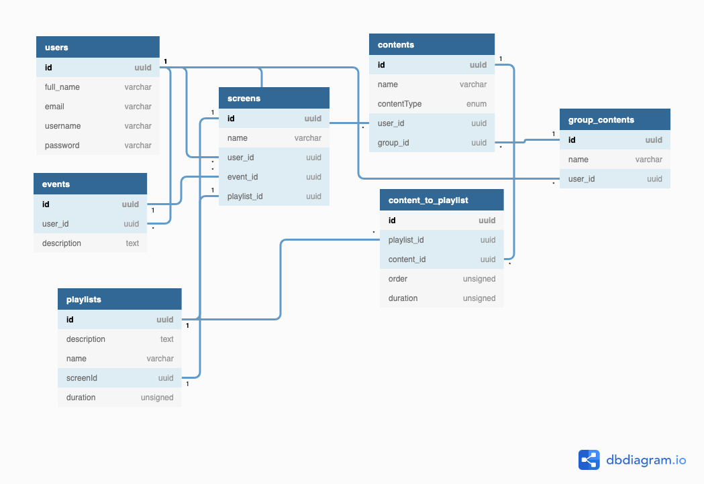

# Screens Sales 📱

## Description

[Nest](https://github.com/nestjs/nest) framework TypeScript starter repository.

cms for selling screens

### Database diagram

<code></img></code>

## Installation

```bash
$ yarn
```

## Running the app

```bash
#running database
$ docker-compose up -d
```

```bash
# development
$ yarn start

# watch mode
$ yarn start:dev

# production mode
$ yarn start:prod
```

## Test

```bash
# unit tests
$ yarn test

# e2e tests
$ yarn test:e2e

# test coverage
$ yarn test:cov
```

Nest is [MIT licensed](LICENSE).
